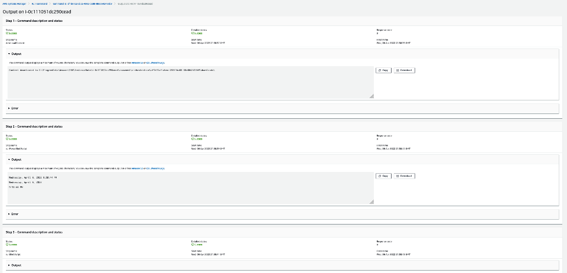

# Stepfunction EC2 SSM

This repo holds the stepfunction workflow for creating EC2 instance and execute remote powershell script for configuration of EC2 using Systems Manager (Run Command)

## Description
There are scenarios where EC2 instances has to be created and need to be configured using Systems Manager powershell script. The script may take a long time depending upon the configuration and it may exceed lambda time limit of 15 mins.This solution provides a serverless approach using stepfunctions and lambda to create EC2 instance, execute the configurations from powershell script, wait for the script to complete by periodcally checking the runCommand status. The workflow also deletes the created EC2 instance irrespective of runCommand execution result.

## Pre-requistie
1.  Terraform Installed
2.  Have the AWS Credentials setup. 

## Architecture

## Usage
These are the steps to be followed to execute this stepfuction workflow:
1.  git clone this repository and goto terraform directory
2.  Update the variables.tf file under terraform directory.
3.  Execute terraform commands, terraform init, terraform plan and terraform apply at terraform directory.
4.  Goto the AWS Console, go to Stepfunctions, pick ec2-ssm-state-machine-workflow and start the execution with empty json.
5.  If you need to destroy your infrastructure, execute the command terraform destroy.

## StepFunction Workflow

## Sample Snapshot of runCommand Execution

## Security

See [CONTRIBUTING](CONTRIBUTING.md#security-issue-notifications) for more information.

## License

This library is licensed under the MIT-0 License. See the LICENSE file.

